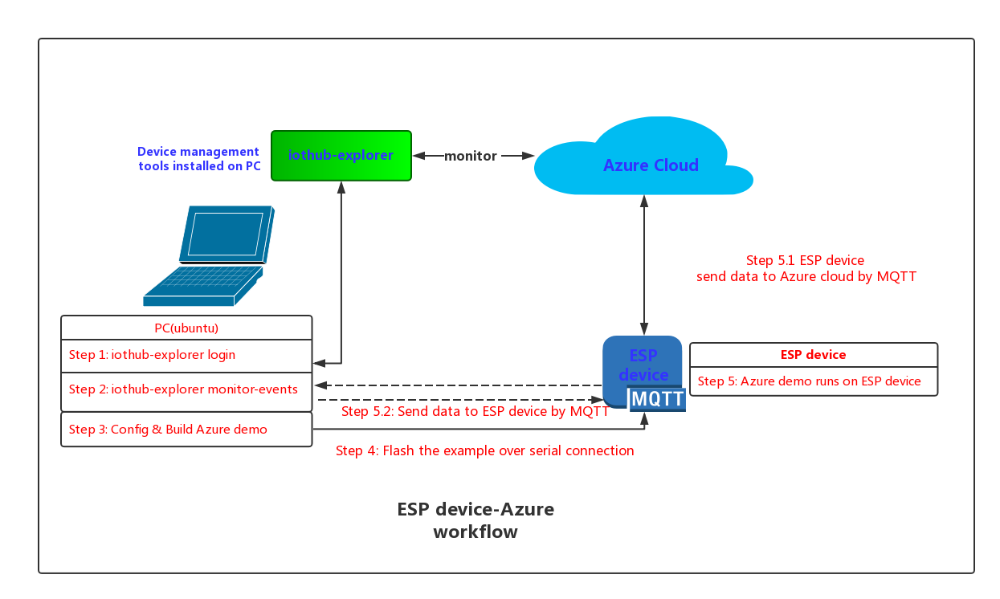

# A MQTT Demo that Connects ESP device to Azure Cloud 

# Table of Contents

- [Introduction](#introduction)
- [Preparation](#preparation)
- [Configuring and Building](#configuring-and-building)
- [Checking Result](#checking-result)
- [Troubleshooting](#troubleshooting)

## Introduction

<a name="Introduction"></a>

Espressif offers a wide range of fully-certified Wi-Fi & BT modules powered by our own advanced SoCs. For more details, see [Espressif Modules](https://www.espressif.com/en/products/hardware/modules).

Azure cloud is one of the most wonderful clouds that collects data from lots of devices or pushes data to IoT devices. For more details, see [Azure IoT Hub](https://www.azure.cn/en-us/home/features/iot-hub/).

This demo demonstrates how to firstly connect your device (ESP devices or IoT devices with ESP devices inside) to Azure, using MQTT protocol, then send data to Azure as well as receive message from Azure. 

Main workflow:

 

## Preparation 

<a name="preparation"></a>

### 1. Hardware

- An **ubuntu environment** should be set up to build your demo;
- Any **[ESP device](https://www.espressif.com/en/products/hardware/modules)** can be used to run your demo.

### 2. Azure IoT Hub

- [Get iothub connection string (primary key)](https://www.azure.cn/en-us/pricing/1rmb-trial-full/?form-type=identityauth) from the Azure IoT Hub, which will be used later. An example can be seen below:

```
HostName=yourname-ms-lot-hub.azure-devices.cn;SharedAccessKeyName=iothubowner;SharedAccessKey=zMeLQ0JTlZXVcHBVOwRFVmlFtcCz+CtbDpUPBWexbIY=
```
- For step-by-step instructions, please click [here](doc/IoT_Suite.md).

### 3. iothub-explorer

- Install [Node.js](https://nodejs.org/en/);  
- Install [iothub-explorer](https://www.npmjs.com/package/iothub-explorer) with command line `npm install -g iothub-explorer`.
  - If failed, please check [here](http://thinglabs.io/workshop/esp8266/setup-azure-iot-hub/) for more information.
  - If succeeded, please check the version information with the command lines below:
```
$ node -v
v6.9.5
$ iothub-explorer -V
1.1.6
```

After that, you should be able to use iothub-explorer to manage your iot-device.

### 4. Device Connection String

- login with the **iothub connection string (primary key)** you got earlier with command lines;
- create your device, and get a **device connection string**. An example can be seen:

``` 
"HostName=esp-hub.azure-devices.net;DeviceId=yourdevice;SharedAccessKey=L7tvFTjFuVTQHtggEtv3rp+tKEJzQLLpDnO0edVGKCg=";
```

For detailed instruction, please click [Here](doc/iothub_explorer.md).
 
### 5. SDK

- [AZURE-SDK](https://github.com/espressif/esp-azure) can be implemented to connect your ESP devices to Azure, using MQTT protocol.
- Espressif SDK
  - For ESP32 platform: [ESP-IDF](https://github.com/espressif/esp-idf)  
  - For ESP8266 platform: [ESP8266_RTOS_SDK](https://github.com/espressif/ESP8266_RTOS_SDK)

### 6. Compiler

- For ESP32 platform: [Here](https://github.com/espressif/esp-idf/blob/master/README.md)
- For ESP8266 platform: [Here](https://github.com/espressif/ESP8266_RTOS_SDK/blob/master/README.md)

## Configuring and Building

<a name="Configuring_and_Building"></a>

### 1. Cloning Git submodules

This repo uses [Git Submodules](https://git-scm.com/book/en/v2/Git-Tools-Submodules) for its dependancies. To successfully clone these other repositories, after cloning this repo, use the following command in the root:

``` bash
git submodule update --init --recursive
```

### 2. Configuring your Azure IOT Hub Device Connection String, Wi-Fi and serial port

- Change to `examples/iothub_client_sample_mqtt` directory
- Run `make menuconfig` -> `Example configuration` to configure your Azure IOT Hub Device Connection String, Wi-Fi SSID and Password; 
- Run `make menuconfig` -> `Serial flasher config` to configure you serial port.

### 3. Building your demo and flash to ESP device with `$make flash`.

If failed, please:

- make sure your ESP device had connected to PC with serial port;
- make sure you have selected the corrected serial port;
  - command `> sudo usermod -a -G dialout $USER` can also be used.

To monitor the device output while running, run 

``` bash
make monitor
```

To exit the monitor, hit Control-]

You can also run the build and monitor in onte step and run with multiple compiler threads:

``` bash
make -j4 flash monitor
```

This will build with four concurrent build processes to take advantage of more cores on your workstation.

## Checking Result

<a name="Checking_Result"></a>

Please check results on both the iothub and device side:

- iothub: log into iothub-explorer, and monitor events with command `iothub-explorer monitor-events yourdevice --login 'yourprimarykey'`
- ESP device: monitor events with command `make monitor`

ESP device would send data to the Azure cloud, and then you would be able to receive data at the iothub side.

## Troubleshooting
<a name="Troubleshooting"></a>

1. Some common problems can be fixed by disabling the firewall.

2. You can try with the followings, if your build fails:
	- git submodule init
	- git submodule update
	- export your compiler path 
	- export your IDF path
	- get start from [Here](https://www.espressif.com/en/support/download/documents)
	
3. Make sure the device connection string you are using, which you get from Azure IoT Hub, is correct.
