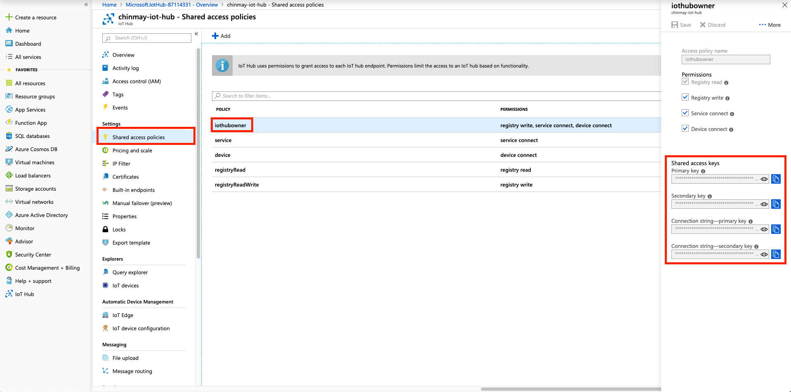

## Applying an Azure Trail Account

1. Go to [Azure IoT Suite](https://www.azure.cn/en-us/home/features/iot-suite/) and click on 1RMB Trail.

	
	
2. Enter you phone number and complete the verification process.
	
	

3. Enter basic information and complete the real name authentication.
	
	

4. Register

	
	
5. Pay 1 RMB to complete the register

	
	
## Obtaining Connection String

1. Go to [Azure IoT Portal](https://portal.azure.cn).

	

2. Click on "All services", and choose "IoT Hub".

	

3. Create a new IoT hub.

	

4. Name your new hub. 

	

5. Obtain your connection string as instructed in the figure below:  

	
