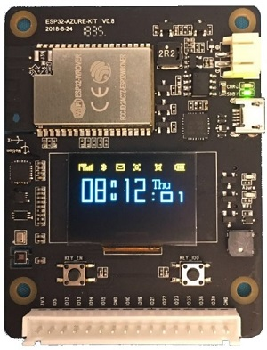
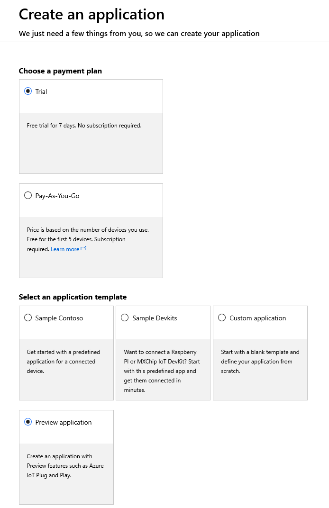
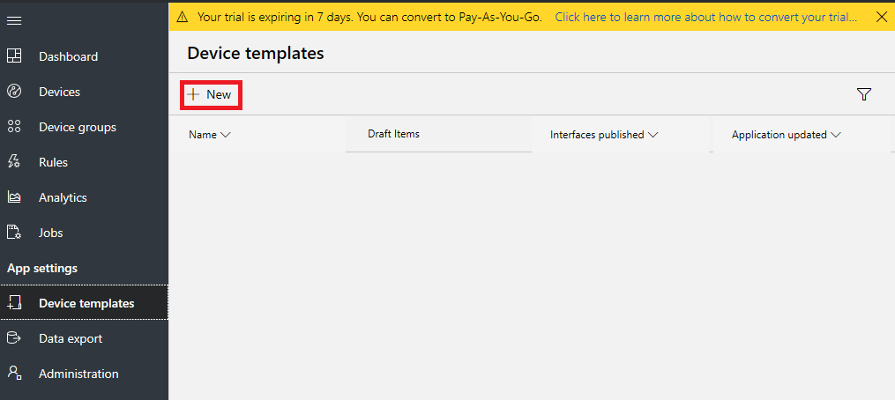
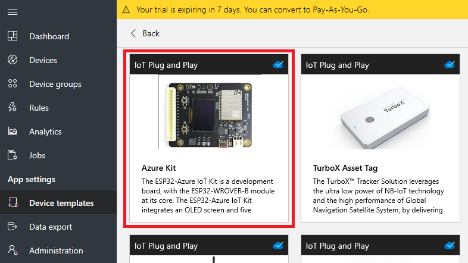
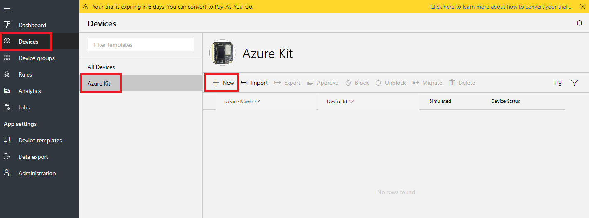
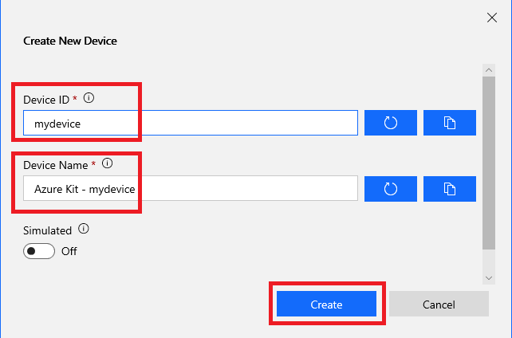
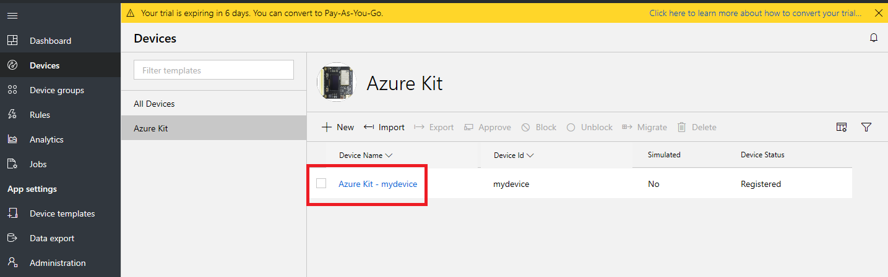
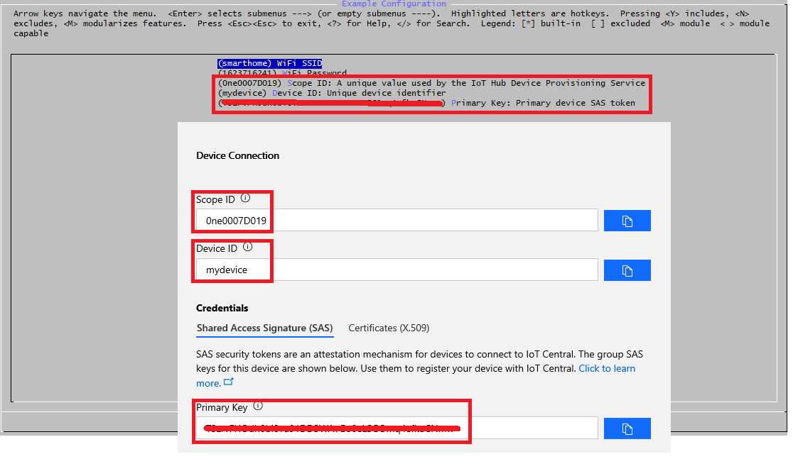
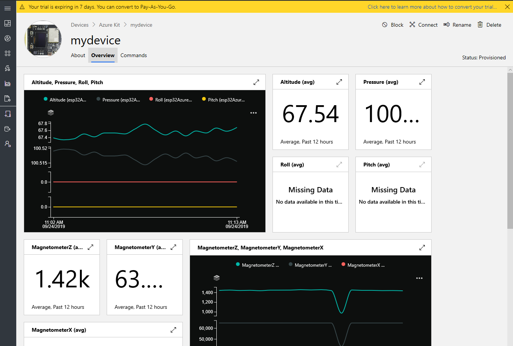
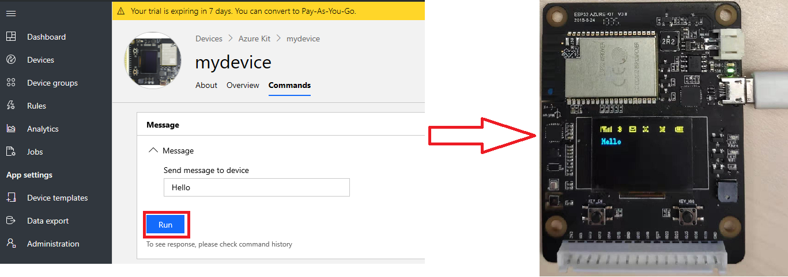

# Implement Azure IoT PnP on esp32-azure-kit based on Azure IoT C public preview SDK.
In this tutorial, you will learn how to use the esp32-azure-kit board to send data to Azure IoT Central with Azure IoT plug and play.

## Features implemented
- Azure IoT plug and play
- Register device by IoT Hub Device Provisioning Service base on an X.509 digital certificate
- Telemetry data sent for all onboard sensors
- Display temperature and humidity on screen
- Cloud to device messages (supports sending a message to display on the screen, press button to go back humiture screen)

## What you need
- An esp32-azure-board kit

    

- An active Azure subscription. If you do not have one, you can register via one of these two methods:
  - Activate a [free 30-day trial Microsoft Azure account](https://azure.microsoft.com/free/).
  - Claim your [Azure credit](https://azure.microsoft.com/pricing/member-offers/msdn-benefits-details/) if you are MSDN or Visual Studio subscriber.

- ESP-IDF (Espressif IoT Development Framework)
  - Please refer the [ESP-IDF Programming Guide](https://docs.espressif.com/projects/esp-idf/en/stable/) to set up the ESP32 development environment.

## How to start
### Prepare the development enviroment
  - Setup the ESP-IDF development environment by following this guide https://docs.espressif.com/projects/esp-idf/en/stable/get-started/
  - Clone the code to your local computer with the command: git clone --recursive https://github.com/espressif/esp-azure.git

### Create Azure IoT Central application
  1. Use your Azure account log into [Azure IoT Central](https://apps.azureiotcentral.com).
  2. Create a **free preview applicaton**.

      
  3. Select **Device templates** and then click **+ New** to create device template.

      
  4. Choose the pre-certified device (ESP32-Azure Kit) to create Device template.

      
  5. Go to the **Devices** page select **Azure Kit** and click **+ New** to create a new device.

      
  6. In the popup device info page, set **Device ID**, **Device Name** and then click **Create** button to create a new device.

     
  7. In the **Devices** page, click the device you created in step 6 to enter device detail info page.

      
  8. Click **Connect** button to get **Scope ID**, **Device ID**, **Primary Key**, and make a note of them.

      

### Build and flash the code
  1. `cd` to the directory **esp-azure/examples/azure_iot_pnp_sample**.
  2. Run `make menuconfig`, and update the values under **Example Configuration** section with the infomation you noted in previous step.
      - **Scope ID:** A unique value used by the IoT Hub Device Provisioning Service. 
      - **Device ID:** Unique device identifier.
      - **Primary Key:** Primary device SAS token.

      

  3. Run `make flash` to flash the app to esp32-azure-kit and wait for the device to reboot.

### View the device in IoT central
  1. In your IoT Central application, go to the **Devices** page and select the device you created in previous step. The device will be automatically registered when the device boots up.

      
    After a couple of minutes, this page will show the telemetry data.

  2. Select the **About** page to see the property values the device sent.
  3. Select the **Commands** page to call commands on the device.

      

 ## Note:
  1. For details about Azure IoT PnP project, please refer to: https://github.com/Azure/azure-iot-sdk-c-pnp/tree/public-preview
  2. If the device can't send telemetry data to IoT central, run the command **make monitor** to check the device logs